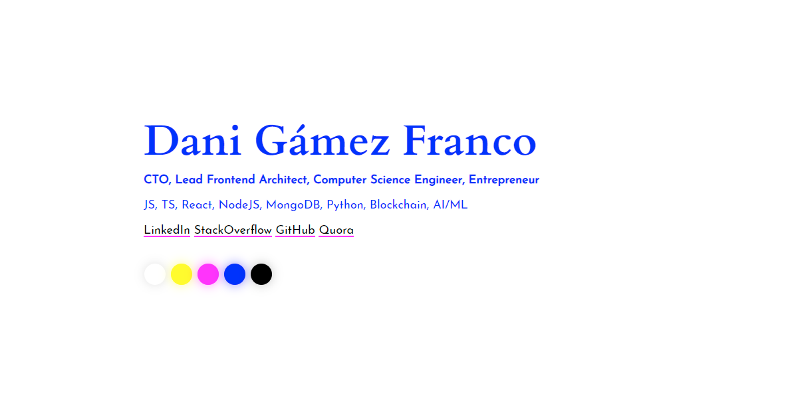

<h1 align="center">GMZcodes</h1>

    👨‍💻 My personal website PWA built using JavaScript, SCSS, HTML5 (inclulding a <code>&lt;canvas&gt;</code>, can you spot it?)!

    🚀 Check it out at <a href="https://gmzcodes.com">https://gmzcodes.com</a>!

    ⏳ Well, actually it's just a placeholder site with some basic data and profiles, for now.

    💩 No IE or Edge. Get the f**k off my property!

 

    

 

Running It (Development)
------------------------

Take a look at `package.json`, the scripts are self-explanatory.

 

Reporting a problem
-------------------

Don't hesitate to report any issue you find in this website/project by opening a new issue in this repository, but please make sure that problem hasn't been reported before by another user.

 

Ongoing Work (TODOs)
--------------------

### Accessibility

- User proper HTML elements (button), and add hover/focus styles to them and to link at the top.
- Breakpoints for main text size.
- Better layout (text should be centered but aligned to left).
- Unsupported browsers warning.
- Offline warning and confirmation when trying to open a link.
- Dynamically resized bottom menu that can accommodate more actions.
- Add a better mobile mode that can lock/unlock the scroll if needed.

### Keyboard Support

- Clear canvas with Esc key.
- Download drawing with Enter key.
- Select colors with numeric keys.
- Make this fully accessible with arrows, space and supr keys.

### Easter Eggs

- Custom color selector (console).
- Random color palette on load: cyberpunk, halloween, christmas
- Night mode.

### Canvas

- Download/share your creation.
- Change cursor/brush size/shape.
- Multitouch on mobile.
- Undo (canvas snapshots).
- Color sorting by usage.
- Custom colors / more colors.
- Resize and keep image.
- Block trajectory in X/Y or diagonal axis.

### Tech

- Add a basic Webpack setup to minify the code.
- Create a GMZPaint class for all the drawing logic.
- Deploy from `dist` directory. See https://medium.com/linagora-engineering/deploying-your-js-app-to-github-pages-the-easy-way-or-not-1ef8c48424b7.
- Screenshot mode.

Author
------

Dani Gámez Franco

LinkedIn: https://www.linkedin.com/in/danigamezfranco/

Stack Overflow: https://stackoverflow.com/users/3723993/danziger
