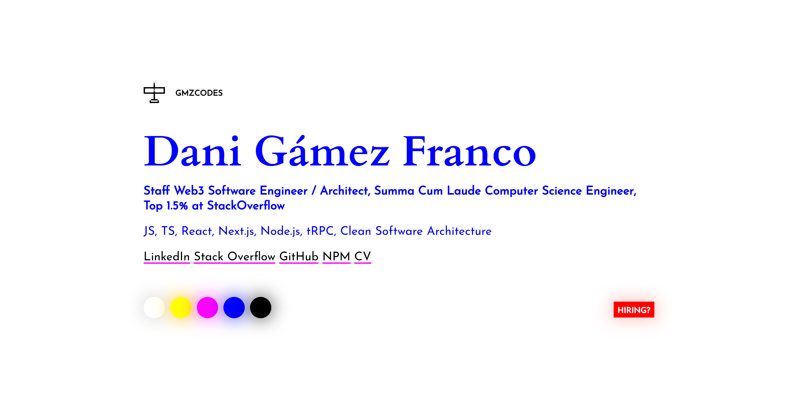

<h1 align="center">GMZcodes</h1>

    👨‍💻 Dani Gamez's personal website PWA built using vanilla JavaScript, SCSS and HTML5.

    🚀 Check it out at <a href="https://gmzcodes.com">https://gmzcodes.com</a>!

 

    

 

Running It (Development)
------------------------

Take a look at `package.json`, the scripts are self-explanatory, but otherwise `npm install` and `npm start` work in `90%` of teh cases :D

The project will be accessible at http://localhost:8080/.

 

Reporting a problem
-------------------

Don't hesitate to report any issue you find in this website/project by opening a new issue in this repository, but please make sure that problem hasn't been reported before by another user.

 

TODOs & Bug
-----------

### Bugs

- Adjust side paddings to be included in the header links and button.

- Hide "Hiring?" label in screenshot mode.

- Close menu when enabling focus mode.

- Hide (custom) cursor while resizing.

- Improve performance on large high-res screens. See:
  - https://developer.mozilla.org/en-US/docs/Web/API/Canvas_API/Tutorial/Optimizing_canvas
  - https://github.com/karellodewijk/canvas-webgl
  - https://github.com/jagenjo/Canvas2DtoWebGL
  - https://www.reddit.com/r/webgl/comments/sc4024/is_webgl_fast_than_canvas_api_for_drawing_a_bunch/
  - Consider breaking down the canvas into smaller ones (tiles).
  - Consider adding other brush shapes, like any other standard drawing app (e.g https://www.youtube.com/watch?v=3GqUM4mEYKA)

- The canvas looks blurry on screens with decimal DPI values. See https://stackoverflow.com/questions/15661339/how-do-i-fix-blurry-text-in-my-html5-canvas.

 

### JS Paint Features

- Image upload. See https://medium.com/@agbales/how-to-make-8-bit-art-with-javascript-eea808a70ba2

- Move cursor position to a corner.

- Multiple types and sizes of brushes (square, circle).

- Consider a non-pixel-art version of the app where you can use a regular "pen" brush.

- Custom colors.

- Undo/redo.

- Resize and keep canvas.

- Multitouch on mobile.

- Block trajectory in X/Y or diagonal axis.

- Fill tool.

 

### Other Features

- Add an option to send drawings to me (to Supabase, maybe).

- Show artist picture.

- Add "Hiring?" and attribution inside the menu too.

- Toggle cursor type (native (default + pen), custom, both). Consider using 2 settings, one for regular interaction and the other one for drawing.

- Consider removing vibration toggle (it can be done from the phone).

 

### Tech Debt

- Update dependencies.

- Use a `<template>` for `.content__warningHeader`.

- Review aria tags and code organization.

 

Some other sites I've built
---------------------------

- **[Stylophone.js](https://danziger.github.io/stylophonejs/)**

  🎹 The classic Stylophone, now in your phone and computer.

- **[Key.js](https://keyjs.dev)**

  ⌨ Press any key to get the JavaScript keyboard event event key, code, which, keyCode and more properties!

- **[Slot.js](https://danziger.github.io/slotjs/)**

  🎰 Circular slot machine mobile-first SPA built with JavaScript, CSS variables and Emojis!

- **[Stars.js](https://danziger.github.io/starsjs/)**

  ✨ Generate a rotating galaxy in a canvas.

- **[Job.js](https://danziger.github.io/jobjs/)**

  💼 Sharable image summaries for your open positions: Share your jobs as an image on LinkedIn and Instagram to get a visibility boost and more applicants!

 

Author
------

Dani Gámez Franco

LinkedIn: https://www.linkedin.com/in/danigamezfranco/

Stack Overflow: https://stackoverflow.com/users/3723993/danziger
