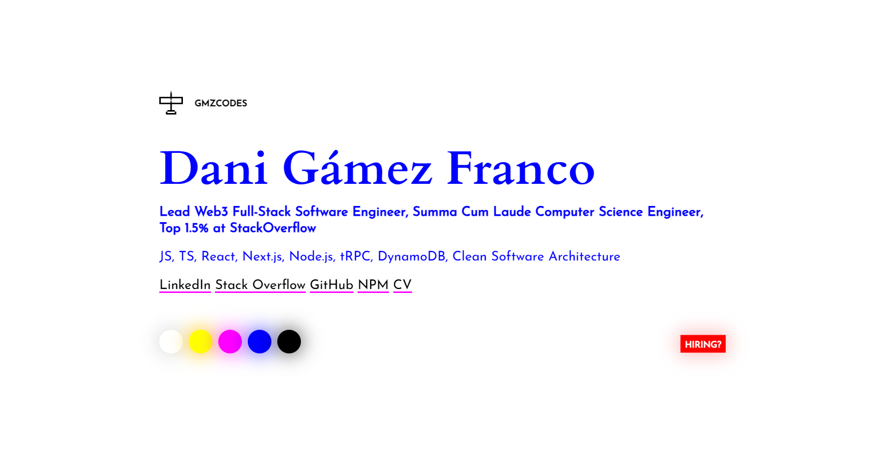

<h1 align="center">GMZcodes</h1>

    👨‍💻 Dani Gamez's personal website PWA built using vanilla JavaScript, SCSS and HTML5.

    🚀 Check it out at <a href="https://gmzcodes.com">https://gmzcodes.com</a>!

    💩 No IE or (old) Edge. Get the f**k off my property!

 

    

 

Running It (Development)
------------------------

Take a look at `package.json`, the scripts are self-explanatory, but otherwise `npm install` and `npm start` work in `90%` of teh cases :D

 

Reporting a problem
-------------------

Don't hesitate to report any issue you find in this website/project by opening a new issue in this repository, but please make sure that problem hasn't been reported before by another user.

 

Known Issues
------------

- The canvas looks blurry on screens with decimal DPI values. See https://stackoverflow.com/questions/15661339/how-do-i-fix-blurry-text-in-my-html5-canvas.

 

WIP
---

- Menu hidden in uncool version.
- Adjust nav outer spacing on narrow viewports.
- Menu option states.
- Menu aria attributes.
- Cursor mode for menu.
- Stop drawing and sound when menu shown.

----

- Show/hide ruler zero manually at the right time.
- Menu can scroll.
- Persist vibration state.
- Rename ruler option to something else.
- Missing focus styles inside menu.
- Close/navigate menu with keyboard.
- Review aria tags and code organization.
- Instructions about keyboard options inside menu.
- Download image with multiple random names: masterpiece, such-wow, amazing-art, professional-painting-so-great, this-good.
- Adjust side paddings to be included in the header links and button.

 

Ideas & TODOs
-------------

- Screenshot mode with multiple sizes.
- Multitouch on mobile.
- Undo/redo.
- Resize and keep canvas.
- Block trajectory in X/Y or diagonal axis.
- Add a placeholder for the page logo in case it doesn't load.
- Image upload. See https://medium.com/@agbales/how-to-make-8-bit-art-with-javascript-eea808a70ba2

Author
------

Dani Gámez Franco

LinkedIn: https://www.linkedin.com/in/danigamezfranco/

Stack Overflow: https://stackoverflow.com/users/3723993/danziger
